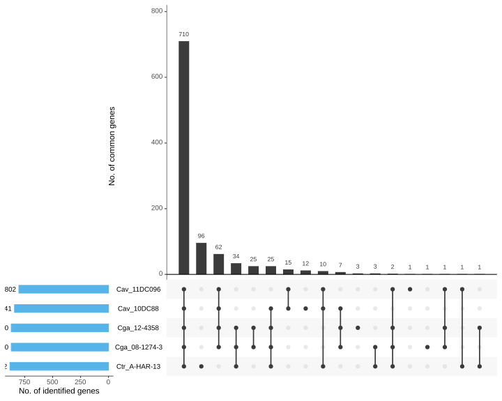
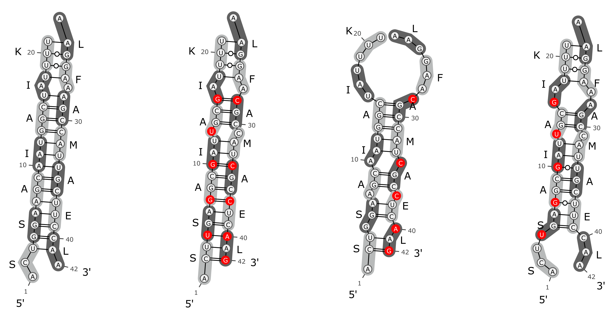

# Tools & Pipelines

Most of our pipelines need only [Nextflow](https://www.nextflow.io/) and [Docker](https://docs.docker.com/v17.09/engine/installation/linux/docker-ce/ubuntu/#install-docker-ce) or [Conda](https://docs.conda.io/en/latest/miniconda.html) installed. Thanks to all developers, contributors and users! 

---
## RNAflow

A simple RNA-Seq differential gene expression pipeline using Nextflow. For a test run, please try:

```bash
nextflow run hoelzer-lab/rnaflow -r v1.1.0 -profile test,local,docker
```

[](https://github.com/hoelzer-lab/rnaflow)

[:octicons-book-16: Publication](https://www.biorxiv.org/content/10.1101/2020.07.24.219899v1) 
[:octicons-mark-github-16: GitHub](https://github.com/hoelzer-lab/rnaflow)


---
## RIBAP 
[{style="width:340px" align="right"}](tools/upsetr.svg)

**R**oary **I**LP **B**acterial **A**nnotation **P**ipeline

RIBAP combines sequence homology information from [Roary](https://github.com/sanger-pathogens/Roary) with smart pairwise [ILP](https://www.ncbi.nlm.nih.gov/pmc/articles/PMC4391664/) calculations to produce a more complete bacterial core gene set. 

```bash
nextflow run hoelzer-lab/ribap -r 0.5.0 --help
```

RIBAP was already used in [Vorimore _et al._ (2021)](https://doi.org/10.1016/j.syapm.2021.126200) and [Hölzer _et al._ (2020)](https://www.mdpi.com/2076-0817/9/11/899). 

[:octicons-mark-github-16: GitHub](https://github.com/hoelzer-lab/ribap)

Currently under heavy development, so expect some bugs but feel free to [report issues](https://github.com/hoelzer-lab/ribap/issues).


---
## PoSeiDon [{style="width:160px" align="right"}](https://github.com/hoelzer/poseidon)

**Po**sitive **Se**lect**i**on **D**etecti**on** and recombination analysis of protein-coding genes.

```bash
nextflow run hoelzer/poseidon -r 1.0.2 --help
```

[:octicons-book-16: Publication](https://doi.org/10.1093/bioinformatics/btaa695) 
[:octicons-mark-github-16: GitHub](https://github.com/hoelzer/poseidon)


---
## PCAGO [{style="width:260px" align="right"}](https://pcago.bioinf.uni-jena.de/)

An interactive web service that allows analysis of RNA-Seq read count data with [PCA](https://towardsdatascience.com/a-step-by-step-explanation-of-principal-component-analysis-b836fb9c97e2) and clustering.

__Recommendation__: run PCAGO locally using Docker (thx Lasse!). Use [Docker](https://www.docker.com/) to run PCAGO on your local machine. If Docker is installed on your system, simply run:

```bash
docker run -p 8000:8000 --rm -it mhoelzer/pcago:1.0--c1e506c ./run_packrat.sh
```

Depending on your system permissions you might need to add `--user $(id -u):$(id -g)` as a parameter. If you execute the Docker image on a server, simply connect to this server with port forwarding (not needed on your local machine):

```bash
ssh -L 8000:127.0.0.1:8000 your@your.server.com
```

In both cases you will then be able to access PCAGO via the following address in your browser: 127.0.0.1:8000.

[:octicons-book-16: Preprint](https://doi.org/10.1101/433078) 
[:octicons-mark-github-16: GitHub](https://github.com/hoelzer-lab/pcago)
[:octicons-flame-16: Webservice](https://pcago.bioinf.uni-jena.de/)

---
## SIM [{style="width:400px" align="right"}](https://github.com/desiro/silentMutations)

SilentMutations (SIM) automatically constructs disrupting and restoring synonymous (silent) mutation pairs within coding regions for combinatorial _in silico_ analysis of (viral) RNA-RNA interactions.

[:octicons-book-16: Publication](https://doi.org/10.1016/j.virusres.2018.11.005) 
[:octicons-mark-github-16: GitHub](https://github.com/desiro/silentMutations)

